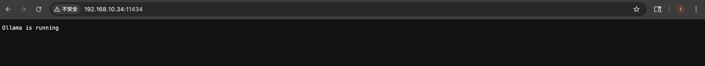

# 项目介绍

本项目是一个非常简单的通过运行的 Ollama 服务器连接本地大语言模型与ai对话的app。

运行效果如下：


关于如何Mac 上运行的 Ollama 服务器连接处理的流程如下：

因为是通过本地的局域网链接，所有得先确认你的ip地址，而且ip地址在`sendMessageToOllama`方法中也是要用到的

请在终端运行：

```bash
ipconfig getifaddr en0
```

打开终端，运行以下命令启动 Ollama：

```bash
OLLAMA_HOST=0.0.0.0 ollama serve
```

你可以尝试在 Mac 上打开浏览器，访问：

```bash
// 这里写自己的iP地址
http://192.168.10.34:11434
```

如果出现 JSON，说明服务正常监听了：




